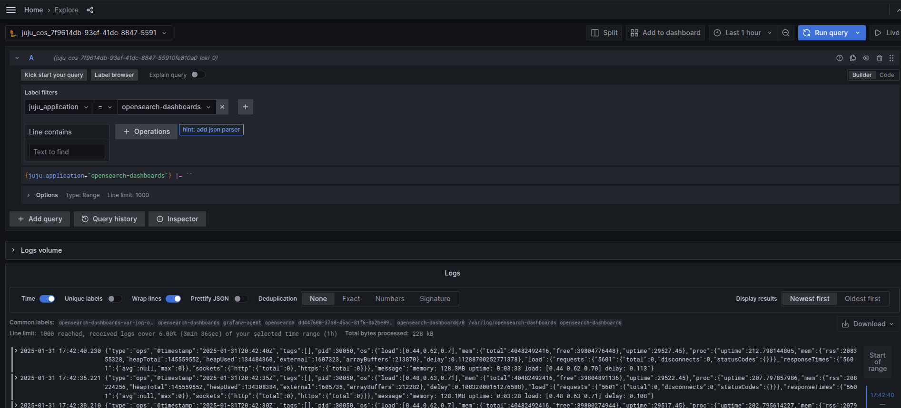

(dashboard-how-to-enable-monitoring)=
# How to enable monitoring (COS)

```{note}
All commands are written for juju >= v.3.1.7
```

The Canonical Observability Stack (COS) is a set of tools that facilitates gathering,
processing, visualizing, and setting up alerts on telemetry signals (metrics, logs, and traces)
generated by workloads in and outside of Juju.

The OpenSearch Dashboards charm can use COS to connect to Grafana and Prometheus
to use monitoring, alert rules, and log features.

## Prerequisites

* A deployed [Charmed OpenSearch Dashboards operator](dashboard-how-to-deploy-connect-scale)
* A deployed [`cos-lite` bundle in a Kubernetes environment](https://charmhub.io/topics/canonical-observability-stack/tutorials/install-microk8s)

```{note}
For cross-model integration to work reliably, deploy COS Lite on a MicroK8s cloud
added to the same Juju controller as OpenSearch Dashboards (`overlord`).
See the [OAuth guide](dashboard-how-to-access-using-oauth) for instructions on
adding MicroK8s to an existing controller. After adding the cloud, create the
`cos` model on it with `juju add-model cos microk8s-cluster`.
```

## Offer interfaces via the COS model

First, switch to the COS model and offer COS interfaces to be cross-model
integrated with the Charmed OpenSearch Dashboards model.

To switch to the COS model, run

```shell
juju switch overlord:cos
```

To offer the COS interfaces, run

```shell
juju offer grafana:grafana-dashboard
juju offer loki:logging
juju offer prometheus:receive-remote-write
```

## Consume offers via the OpenSearch Dashboards model

Next, switch to the Charmed OpenSearch Dashboards model, find offers, and consume them.

You are currently on the COS model.
To switch to the OpenSearch Dashboards model, run

```shell
juju switch overlord:tutorial
```

To consume offers to be reachable in the current model, run

```shell
juju consume admin/cos.grafana
juju consume admin/cos.loki
juju consume admin/cos.prometheus
```

## Deploy and integrate Grafana

First, deploy [grafana-agent](https://charmhub.io/grafana-agent):

```shell
juju deploy grafana-agent
```

Then integrate `grafana-agent` with consumed COS offers:

```shell
juju integrate grafana-agent grafana
juju integrate grafana-agent loki
juju integrate grafana-agent prometheus
```

Finally integrate (previously known as
[relate](https://documentation.ubuntu.com/juju/3.6/reference/relation/))
it with Charmed OpenSearch Dashboards:

```shell
juju integrate grafana-agent opensearch-dashboards
```

After the integration is complete, Grafana shows the new dashboard
`Charmed OpenSearch Dashboards` and allows access to Charmed OpenSearch Dashboards logs on Loki.

## Connect to the Grafana web interface

To connect to the Grafana web interface, follow the
[Browse dashboards](https://documentation.ubuntu.com/observability/latest/tutorial/cos-lite-microk8s-sandbox/#browse-dashboards)
section of the MicroK8s "Getting started" guide.

Obtain the admin password as follows:

```shell
juju run grafana/leader get-admin-password --model overlord:cos
```

For details on available metrics and default alert rules, see the
[Monitoring reference: metrics and alert rules](dashboard-reference-monitoring).

## Logs

All the logs from the OpenSearch Dashboards payload are available in the Grafana
web interface at `Home > Explore`.

To get OpenSearch Dashboards logs, go to the `Label filters` field and set to
`juju_application = opensearch-dashboards`, select one operation,
e.g. `Line contains` and run the query.

