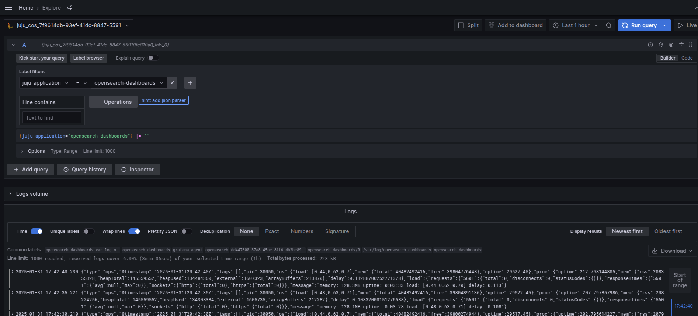

(dashboard-how-to-enable-monitoring)=
# How to enable monitoring (COS)

```{note}
All commands are written for Juju 3.1.7 or later.
```

The Canonical Observability Stack (COS) collects metrics and logs from Charmed OpenSearch
Dashboards. It provides a Grafana dashboard, Prometheus alert rules, and logs in Loki.

The integration depends on where Dashboards runs. On VMs, `opensearch-dashboards` exposes
the `cos-agent` endpoint to a machine `grafana-agent`, which forwards telemetry to COS Lite.
On Kubernetes, `opensearch-dashboards-k8s` exposes `metrics-endpoint`, `grafana-dashboard`,
and `logging`, and a `grafana-agent-k8s` charm in the Dashboards model collects and forwards
the telemetry to COS Lite. If COS Lite runs in the same model, Dashboards can integrate with
the COS applications directly instead.

## Prerequisites

`````{tab-set}
---
sync-group: substrate
---
````{tab-item} VM
:sync: vm

* A deployed [Charmed OpenSearch Dashboards operator](dashboard-how-to-deploy-connect-scale)
	in a machine model, integrated with Charmed OpenSearch.
* A deployed [COS Lite bundle on Kubernetes](https://documentation.ubuntu.com/observability/track-3.0/tutorial/cos-lite-microk8s-sandbox/)
	in a separate model.

If using a VM and MicroK8s under the same Juju controller, see the
[OAuth guide](dashboard-how-to-access-using-oauth) for how to add MicroK8s to that controller.
Create a separate `cos` model on it with `juju add-model cos microk8s-cluster` before
deploying COS Lite.
````

````{tab-item} K8s
:sync: k8s

* A deployed [`opensearch-dashboards-k8s`](https://charmhub.io/opensearch-dashboards-k8s)
	application in a Kubernetes model, integrated with Charmed OpenSearch.
* A deployed [COS Lite bundle on Kubernetes](https://documentation.ubuntu.com/observability/track-3.0/tutorial/cos-lite-microk8s-sandbox/),
	either in a separate model or alongside Dashboards in the same model.

COS [recommends a separate model](https://documentation.ubuntu.com/observability/track-3.0/reference/topology/#deploy-in-isolation).
If COS Lite and Dashboards run in the same model, skip the next two sections
and [integrate directly](dashboard-integrate-with-cos).
````
`````

The steps below use `<cos-controller>:<cos-model>` for the COS Lite model and
`<dashboards-controller>:<dashboards-model>` for the Dashboards model. For example,
if both models are on the `overlord` controller, use `overlord:cos` and
`overlord:tutorial`. Substitute your own controller, model, and offer owner as needed.

## Offer COS interfaces

If COS Lite runs in a separate model from Dashboards, switch to the COS model
and offer its endpoints:

```shell
juju switch <cos-controller>:<cos-model>
juju offer grafana:grafana-dashboard grafana-dashboards
juju offer loki:logging loki-logging
juju offer prometheus:receive-remote-write prometheus-receive-remote-write
```

If you deployed COS Lite with the [offers overlay](https://github.com/canonical/cos-lite-bundle/blob/main/overlays/offers-overlay.yaml),
these offers already exist; do not create them again.

## Consume offers

If COS Lite runs in a separate model from Dashboards, switch to the Dashboards
model and consume the offers:

```shell
juju switch <dashboards-controller>:<dashboards-model>
juju consume <cos-controller>:admin/<cos-model>.grafana-dashboards
juju consume <cos-controller>:admin/<cos-model>.loki-logging
juju consume <cos-controller>:admin/<cos-model>.prometheus-receive-remote-write
```

(dashboard-integrate-with-cos)=
## Integrate with COS

`````{tab-set}
---
sync-group: substrate
---
````{tab-item} VM
:sync: vm

Deploy [grafana-agent](https://charmhub.io/grafana-agent) in the Dashboards model:

```shell
juju deploy grafana-agent
```

Integrate it with the consumed COS offers:

```shell
juju integrate grafana-agent grafana-dashboards
juju integrate grafana-agent loki-logging
juju integrate grafana-agent prometheus-receive-remote-write
```

Then integrate it with Dashboards:

```shell
juju integrate grafana-agent opensearch-dashboards:cos-agent
```
````

````{tab-item} K8s
:sync: k8s

Deploy [grafana-agent-k8s](https://charmhub.io/grafana-agent-k8s) in the Dashboards model:

```shell
juju deploy grafana-agent-k8s --trust
```

Integrate it with the consumed COS offers:

```shell
juju integrate grafana-agent-k8s:grafana-dashboards-provider grafana-dashboards
juju integrate grafana-agent-k8s:logging-consumer loki-logging
juju integrate grafana-agent-k8s:send-remote-write prometheus-receive-remote-write
```

Then integrate it with Dashboards:

```shell
juju integrate opensearch-dashboards-k8s:metrics-endpoint grafana-agent-k8s:metrics-endpoint
juju integrate opensearch-dashboards-k8s:grafana-dashboard grafana-agent-k8s:grafana-dashboards-consumer
juju integrate opensearch-dashboards-k8s:logging grafana-agent-k8s:logging-provider
```

* `metrics-endpoint` lets the agent scrape the Dashboards metrics endpoint.
* `grafana-dashboard` transfers the **Charmed OpenSearch Dashboards** dashboard.
* `logging` sends the Dashboards logs.

If COS Lite and Dashboards run in the same model, skip the agent and
the offer and consume sections above. Integrate Dashboards with the COS applications directly:

```shell
juju integrate opensearch-dashboards-k8s:metrics-endpoint prometheus:metrics-endpoint
juju integrate opensearch-dashboards-k8s:grafana-dashboard grafana:grafana-dashboard
juju integrate opensearch-dashboards-k8s:logging loki:logging
```
````
`````

After integration, Grafana displays the **Charmed OpenSearch Dashboards** dashboard,
and Loki receives Dashboards logs.

## Connect to Grafana

To connect to the Grafana web interface, follow the
[Browse dashboards](https://documentation.ubuntu.com/observability/track-3.0/tutorial/cos-lite-microk8s-sandbox/#browse-dashboards)
section of the MicroK8s "Getting started" guide.

Obtain the admin password from the model where COS Lite runs (the Dashboards
model if you used the same-model K8s option):

```shell
juju run grafana/leader get-admin-password --model <cos-controller>:<cos-model>
```

For details on available metrics and default alert rules, see the
[Monitoring reference: metrics and alert rules](dashboard-reference-monitoring).

## Logs

To view OpenSearch Dashboards logs, open `Home > Explore` in Grafana. In
`Label filters`, set `juju_application` to your Dashboards application name
(for example, `opensearch-dashboards` on VMs or `opensearch-dashboards-k8s`
on Kubernetes). Select an operation such as `Line contains` and run the query.

The following screenshot shows a VM application as an example:

